Objective: create a full stack python app with a Postgres database, using the django framework. Explore features that make django popular (user auth, admin panel)

#

## Set up project 

Create a directory for the project and move into that directory: 
```bash
mkdir django && cd django
```

Check that python3 is installed and updated to an appropriate version number (should return something like "Python 3.9.12"): 
```bash
python3 --version
```

Create a virtual environment: 
```bash
python3 -m venv .env
```
We'll use the built in `venv` command and call out virtual environment ".env".

*there are other packages like anaconda which can create a virtual environment for you*

#
ACTIVATE VIRTUAL ENVIRONMENT!

`source .env/bin/activate`

You need to activate the env before you do any work on this project! Every time!

*You can tell when you're in the activated environment because your terminal should show "(.env)" in the prompt.*
#

Let's install some packages we'll need: 
```bash
pip3 install django
```

"pip3" is the package manager we'll use for python, like "npm" was the package manager for our javascript projects.

Check Django was installed: 
```bash
pip3 list
```
which should return something like:
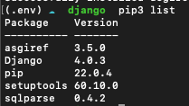

Install "psycopg2" or "psycopg2-binary" which will allow us to use PostgreSQL with Django: 
```bash
pip3 install psycopg2
``` 
OR 
```bash 
pip3 install psycopg2-binary
```

If you run into an error installing psycopg2, install using this command: 
```bash
env LDFLAGS="-I/usr/local/opt/openssl/include -L/usr/local/opt/openssl/lib" pip3 install psycopg2
```

Now we'll save the installed packages as a list of dependencies in a text file: 
```bash
pip3 freeze > requirements.txt
```

That command should create a new .txt file and it's contents should look like the result from "pip3 list". 

#

IF YOU'RE CLONING A DJANGO PROJECT:

After creating and entering your virtual environment, install the dependencies from the cloned project with: 
```bash
pip3 install -r requirements.txt
```

#

## Create the project

Use the "django-admin" command to generate some of the project: 
```bash
django-admin startproject show_collector_project . 
```

We'll create and collect tv-shows for our CRUD, so let's name our project "show_collector_project".
This command will create a directory of the same name as the project name argument provided in the last command, as well as a "manage.py" file. This app is our web application.

We'll also create a different app where we can implement the main functionality of collecting tv-shows. We'll name this app "main_app": 
```bash
python3 manage.py startapp main_app
```

Now there is another directory at the same level as "show_collector_project" that is called "main_app".

To use "main_app" we need to include it in the list of "INSTALLED_APPS" in the settings.py file.
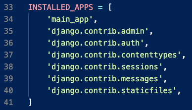

Now we can see if our project starts up! Run `python3 manage.py runserver`

* Don't worry about warnings about unapplied migrations, we are not at that step yet *

Visit `"localhost:8000"` to check if you see the Django rocket!

After confirming you get the rocket, stop your server with `"control + c"`.

#

## Create the database

Enter the psql shell: 
```bash
psql
```

Create a sql database: 
```sql
CREATE DATABASE showcollector;
```

Now set the configuration in "settings.py" so the engine is postgresql and the name matches what's in the databse:

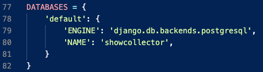

Django uses SQLite by default, but we've been using PostgreSQL so make sure that is changed!

Starting the server now will show the red warning messages about unapplied migrations, so we'll update the database connection with: 
```bash
python3 manage.py migrate
```

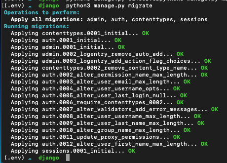
We'll use this same command throught the project to update the database schema.

Run the server again to confirm the warning message is gone:
```bash
python3 manage.py runserver
```

#

## Create the route

A route's purpose is to connect an HTTP request to it's corresponding code. In contrast to Express, Django's routing matches the URL of the request and ignores the HTTP verb. Django defines it's routes in the "urls.py" file, but since this is in the main project, and it's a Django best practice for each app to control it's own routes, and include that app in the "urls.py".

Create a file for "main_app"'s urls: 
```bash
touch main_app/urls.py
```

Import the include keyword from `django.urls`, and add the path to main_app urls in "show_collector_project/urls.py":

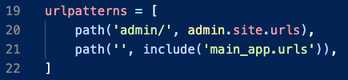
This will mount any routes created in "main_app".

In `main_app/urls.py`:
```python
from django.urls import path
from . import views

urlpatterns = [
    
]
```

We'll fill the empty list in "main_app/urls.py" with a route for Home.

In `main_app/urls.py`:
```python
urlpatterns = [
    path('', views.home, name='home'),
]
```

We've defined the Home route, on to the view!

#

## Create the view

Now we'll add to "main_app/views.py" so that a simple message is rendered on the home page. We'll import "HttpResponse" which is similar to the Express res.send(), and use that to confirm our view is working.

In `main_app/views.py`
```python
from django.shortcuts import render

# Add the following import
from django.http import HttpResponse

# Define the home view
def home(request):
  return HttpResponse('<h1> (╯°□°）╯︵ ┻━┻ </h1>')
```

Save the file and refresh the browser to see our table flip kaomoji. The view function needs a parameter to accept a request object passed from Django, this parameter is commonly called "request".

#

## Create the model

Our server runs and renders a simple view, those are great babysteps! Next let's make sure we can interact with the database for our CRUD.

In `main_app/models.py`:
```python
class Show(models.Model):
    title = models.CharField(max_length=100)
    genre = models.CharField(max_length=50)
    premiere_date = models.DateField(auto_now=False)

    class Rating(models.IntegerChoices):
        LIKE_IT = 1
        LOVE_IT = 2
        GOTTA_HAVE_IT = 3
    review = models.IntegerField(choices=Rating.choices)

    def __str__(self):
        return self.title  
```

Here are a few notes:
- [Django documentation](https://docs.djangoproject.com/en/4.0/ref/models/fields/#module-django.db.models.fields)
- not sure if the nested class of Rating and the review field will work?
- might need to add a "auto_now_add=False" to the premiere_date field so it doesn't overwrite the date on save

The fields that we give the model will be represented as columns in our database after the migration. We need to translate the code we wrote to a schema for our database, which we will do by using migrations.
Running migrations has two steps: `makemigrations` and `migrate`

Run these commands to make migration file and migrate to db:
```bash
python3 manage.py makemigrations
python3 manage.py migrate
```

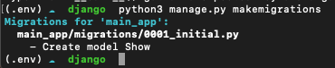

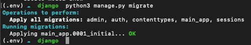

Move into the psql shell to confirm the migration has been applied:
```bash
psql showcollector
```
```sql
\dt
SELECT * FROM main_app_show;
```
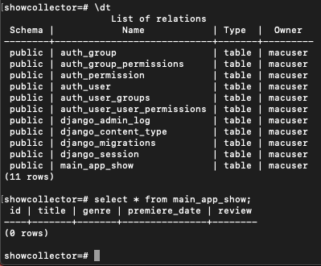

#

# CHECK IN: can everyone run their server and query the database?

## Create a Django superuser

The documenation on Django User objects is [here (creating users, authenticating users)](https://docs.djangoproject.com/en/4.0/topics/auth/default/#user-objects-1) and [here(User fields, attributes, methods)](https://docs.djangoproject.com/en/4.0/ref/contrib/auth/#user-model)

To acces the Django admin console we'll need "superuser" credentials,

Create a superuser: 
```bash
python3 manage.py createsuperuser
```

When prompted, provide "admin" as the username and password *(overwrite default password requirements)*

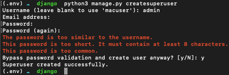

Run the server and navigate to `"localhost:8000/admin"` and log in with the credentials we just created. 

*If you drop your database throughout this project, you'll need to CREATE A NEW SUPERUSER!*

There's not much happening in the admin panel, we don't see "show" at all yet:

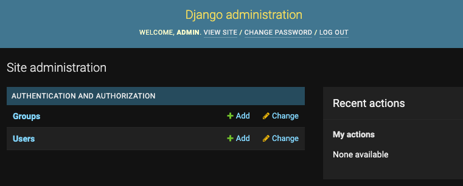

To pull the Show model into the admin panel, we need to register it in `main_app/admin.py`:
```python
from django.contrib import admin
from .models import Show

admin.site.register(Show)
```

Refreshing the page will now show us this: 

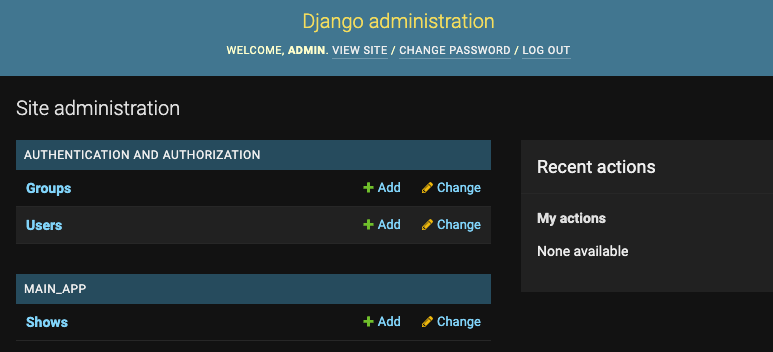

#

## Create show via admin panel

Click "Shows" and create a new record by saving data in the admin panel.

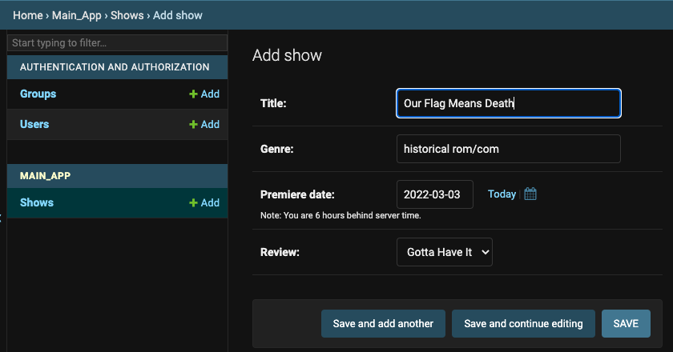

Confirm the show has appeared the in database:

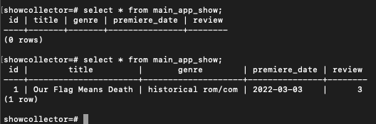

#

## Create URL & View for "shows/" 

Create the urlpattern for a page where we'll render all shows. Add the namespace to the path so we can use it for rendering later.

In `main_app/urls.py`:
```python
urlpatterns = [
    # add after home url
    path('shows/', views.shows, name='shows'),
]
```

Import the Show model to the views file, query the database for all show objects, and print the data to the conosole. Set a simple HttpResponse for the return value.

In `main_app/views.py`:
```python
# add after imports
from .models import Show
# add after home view 
def shows(request):
    print("SHOWS PAGE", Show.objects.all())
    return HttpResponse('<h1>TV Shows</h1>')
```
Check the console running the server for the QuerySet,


We've created a baby step way to see our data after the request, next we'll create a view function that will render a template to display the shows. 

#

## Create template for "shows/"

Documentation on using Djangos built in template language can be found [here(DTL syntax, variables, tags)](https://docs.djangoproject.com/en/4.0/topics/templates/#the-django-template-language) and it's use [here(loops, conditionals)](https://docs.djangoproject.com/en/4.0/ref/templates/language/#templates).


Change the "shows" view so that it renders a template and passes data from the database. 

In `main_app/views.py`:
```python
def shows(request):
    shows = Show.objects.all()
    return render(request, 'shows_list.html', {'shows': shows})
```
Documentation [here](https://docs.djangoproject.com/en/4.0/topics/db/queries/#retrieving-all-objects) on retrieving all objects. 

The `render()` takes 3 arguments: the request object, the template filename to render, and a dictionary with the data to be sent.

Create a directory for templates and a file for the shows list:
```bash
mkdir main_app/templates
touch main_app/templates/shows_list.html
```

In `main_app/templates/show_list.html`:
```html
<div>
    <h2>
        TV Shows
        <a href="">(+)</a>
    </h2>
    <ul>
        
            <li>
                {{ show.title }},
                {{ show.review }}/3
            </li>
        
    </ul>
</div>
```
Confirm by visiting `"localhost:8000/shows"`

#

## Create new Show form

Documentation on forms [here](https://docs.djangoproject.com/en/4.0/topics/forms/#html-forms)

Create a forms file: 
```bash
touch main_app/form.py
```

In `main_app/form.py`:
```python
from django import forms
from .models import Show

class ShowForm(forms.ModelForm):
    class Meta:
        model = Show
        fields = ['title', 'genre', 'premiere_date', 'review']
```
Documentation on [ModelForm](https://docs.djangoproject.com/en/4.0/topics/forms/modelforms/#creating-forms-from-models) showing `class Meta`.


After creating the form, create a view to render it. If the request method is POST then we'll use the request.POST data to fill out the form, validate, and save it. Else, render the form without any data. 


In `main_app/views.py`:
```python
# add after imports
from django.shortcuts import render, redirect
from .form import ShowForm
# add after 'shows' view
def show_create(request):
    if request.method == 'POST':
        form = ShowForm(request.POST)
        if form.is_valid():
            show = form.save()
            return redirect('shows')
    else:
        form = ShowForm()
    context = {'form': form, 'header': 'Add new tv show'}
    return render(request, 'show_form.html', context)
```
Documentation on [ModelForm save()](https://docs.djangoproject.com/en/4.0/topics/forms/modelforms/#the-save-method)

Create the template file to serve up our form so the server doesn't error out.

Create the template file: 
```bash
touch main_app/templates/show_form.html
```

In `main_app/templates/show_form.html`:
```html
<section>
    <h1>{{ header }}</h1>
    <form method="POST">
        
        {{ form.as_p }}
        <button type="submit">Save</button>
    </form>
</section>
```
Documentation on [form.as_p](https://docs.djangoproject.com/en/4.0/ref/forms/api/#as-p)

In `main_app/urls.py`:
```python
urlpatterns = [
    # add after 'shows/' url
    path('shows/add/', views.show_create, name='show_create_form'),
]
```
Complete the link in "shows_list.html" by adding a href attribute to the url we just made.

In `main_app/shows_list.html`:
```html
<h2>
    TV Shows
    <a href="add">(+)</a>
</h2>
```

Travel to that url now!

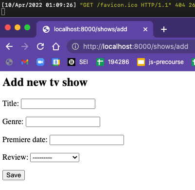

Use the form to create a new show in your database.

#

# CHECK IN: can everyone create a superuser, show from admin panel, show from html form?


## Create edit Show view & URL

To create an edit form we need a new view function and urlpattern.

In `main_app/views.py`:
```python
# add after 'show_create' view
def show_edit(request, pk):
    show = Show.objects.get(pk=pk)
    if request.method == 'POST':
        form = ShowForm(request.POST, instance=show)
        if form.is_valid():
            show = form.save()
            return redirect('shows')
    else: 
        form = ShowForm(instance=show)
    return render(request, 'show_form.html', {'form': form})
```
In `main_app/urls.py`:
```python
urlpatterns = [
    # add after 'show_create_form'
    path('shows/<int:pk>/edit', views.show_edit, name='show_edit_form'),
]
```
Add a link in the html to the title of the show, which directs to the 'show_edit_form' url.

In `main_app/templates/shows_list.html`:
```html
<a href="{{ show.id }}/edit">
    {{ show.title }},
</a>
```
Refreshing the shows list page should now link straight to the edit page for each show. Give it a test!

#

## Create delete Show view & URL

In `main_app/templates/shows_list.html`:
```html
{{ show.review }}/3
<a href="{{ show.id }}/delete">X</a>
```
In `main_app/views.py`:
```python
# add after 'show_edit' view
def show_delete(request, pk):
    Show.objects.get(pk=pk).delete()
    return redirect('shows')
```
In `main_app/urls.py`:
```python
urlpatterns = [
    # add after 'show_edit_form'
    path('shows/<int:pk>/delete', views.show_delete, name='show_delete'),
]
```
#

# CHECK IN: can everyone edit and delete show?


## Create a User
[Django Doc](https://docs.djangoproject.com/en/4.0/topics/auth/default/#creating-users),
[Log in a user](https://docs.djangoproject.com/en/4.0/topics/auth/default/#how-to-log-a-user-in-1)

The easiest way to create a user is by using the admin panel, let's use that *(skipping the buildout of a registration form for now)* to create a user and log them in.

Credentials:

`username: testuser1,`

`password: userpassword1`

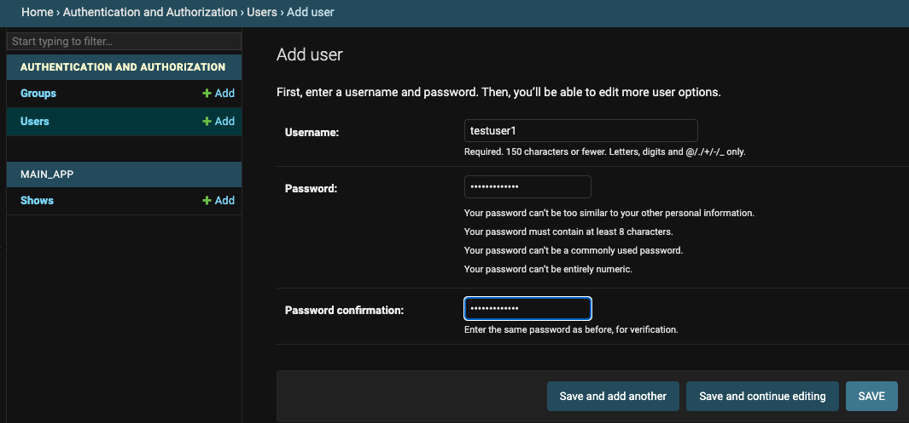

There will be other options to select, fill those out, and confirm the user has been added to the table "auth_user" in the database.
```sql
showcollector=# SELECT * FROM auth_user;
```

We have a user in our database! 

#

## Create Login URL, view, template

In `main_app/urls.py`:
```python
    path('login/', views.login_page, name='login_page'),
```
In `main_app/views.py`:
```python
# add after imports
from django.contrib.auth import authenticate, login
# add after 'show_delete' view
def login_page(request):
    return render(request, 'login_form.html')
```
Create a file for the login form: 
```bash
touch main_app/templates/login_form.html
```
In `main_app/templates/login_form.html`:
```html
<div>
    <h2>Login</h2>
    <form method="POST" action="">
        
        <label for="username">username</label>
        <input type="text" name="username">
        <label for="password">password</label>
        <input type="password" name="password">
        <button type="submit">Save</button>
    </form>
</div>
```

#

## Profile URL, view, & template
```python
# add after 'login_page'
def profile_show(request):
    username = request.POST['username']
    password = request.POST['password']
    user = authenticate(request, username=username, password=password)
    if user is not None:
        login(request,user)
        return render(request, 'profile.html')
    else:
        return HttpResponse('<h1>Something went wrong with login</h1>')
```

In `main_app/urls.py`:
```python
urlpatterns =[
    #add after 'login_page'
    path('profile/', views.profile_show, name='profile'),
]
```
Create profile html: 
```bash
touch main_app/templates/profile.html
```
In `main_app/templates/profile.html`:
```html
<div>
    <h2>Profile page</h2>
    <h4>{{ user.username }}</h4>
</div>
```

#

# CHECK IN: can everyone see user in database, render login form, see username on profile?

## Create Navbar

Create 'base.html' file: 
```bash
touch main_app/templates/base.html
```

In `main_app/templates/base.html`:
```html


<!DOCTYPE html>
<html lang="en">
<head>
    <meta charset="UTF-8">
    <meta http-equiv="X-UA-Compatible" content="IE=edge">
    <meta name="viewport" content="width=device-width, initial-scale=1.0">
    <title>Document</title>
</head>
<body>
    <header>
        <nav>
            <ul>
                <li><a href="">All Shows</a></li>
                
                    <li><a href="">Profile</a></li>
                    <li><a href="">New Show</a></li>
                    <li><a href="">Logout</a></li>
                
                    <li><a href="">Login</a></li>
                
            </ul>
        </nav>
    </header>
    <main>
        
        
    </main>
</body>
</html>
```
Now we're going to add these lines to each of the html files:
```html




```
The contents of the file should go between the block tags.

#

## Create Logout

In `main_app/urls.py`:
```python
urlpatterns = [
    # add after 'profile'
    path('logout/', views.logout_view, name='logout'),
]
```
In `main_app/views.py`:
```python
from django.contrib.auth import authenticate, login, logout
# add after 'profile_show'
def logout_view(request):
    logout(request)
    return redirect('shows')
```

#

# CHECK IN: can everyone navigate via navbar, and logout?


## Route Protection

[Documentation](https://docs.djangoproject.com/en/4.0/topics/auth/default/#django.contrib.auth.decorators.login_required) on `@login_required` decorator

In `main_app/views.py`:
```python
# add after imports
from django.contrib.auth.decorators import login_required
# add above show_create, show_edit, show_delete
@login_required(login_url='/login/')
```
Adding the decorator to these views would result in an error if we navigate to that protected route; providing the `login_url` parameter will prevent us from getting this error:

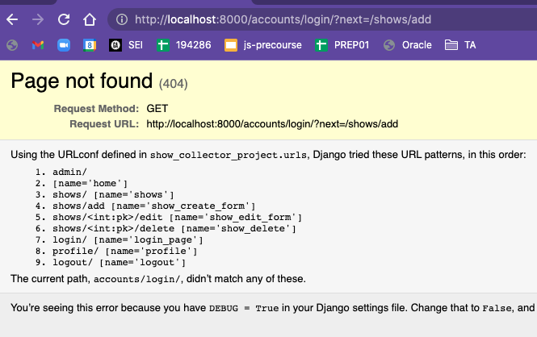


#

## Change profile page

*We could probably use some partials or template inheritance to populate the 'shows_list.html' in the 'profile.html', but we'll just copy over the code in the html.*

[template inheritance docs](https://docs.djangoproject.com/en/4.0/ref/templates/language/#template-inheritance-1)

In `main_app/templates/profile.html`:
```html


<div>
    <h2>Profile page</h2>
    <h4>{{ user.username }}</h4>
    <ul>
        
        <li>
            <a href="{{ show.id }}/edit">
                {{ show.title }},
            </a>
            {{ show.review }}/3
            <a href="{{ show.id }}/delete">X</a>
        </li>
        
    </ul>
</div>

```
Add to our view by filtering the show objects for titles that start with 'O'. Include that context dictionary in the render so it can be used by the view.

In `main_app/views.py`:
```python
def profile_show(request):
    if request.user.is_authenticated:
        shows = Show.objects.filter(title__startswith='O')
        return render(request, 'profile.html', {'shows': shows})
    else:
        username = request.POST['username']
        password = request.POST['password']
        user = authenticate(request, username=username, password=password)
        if user is not None:
            login(request,user)
            return render(request, 'profile.html')
        else:
            print("SOMETHING WENT WRONG WITH LOGIN")
            return redirect('login_page')
```
Confirm it works by visiting the profile page:
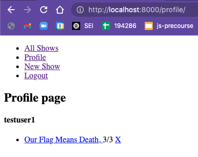

Now we need to change the model so that a show can be owned by a user, so we can filter shows by their user.id to display on the profile.

#

# CHECK IN: are your routes protected? are your profile shows filtering?

## Change the model

Add a "user" column to the schema.

In `main_app/models.py`:
```python
from django.contrib.auth.models import User
class Show(models.Model):
    title = models.CharField(max_length=100)
    genre = models.CharField(max_length=50)
    premiere_date = models.DateField(auto_now=False)
    user = models.ForeignKey(User, on_delete=models.CASCADE, related_name='shows', default=None)
    class Rating(models.IntegerChoices):
        LIKE_IT = 1
        LOVE_IT = 2
        GOTTA_HAVE_IT = 3
    review = models.IntegerField(choices=Rating.choices)

    def __str__(self):
        return self.title
```
Drop the database, recreate it 
```sql
DROP DATABASE showcollector; 
CREATE DATABASE showcollector;
```
Make migrations and migrate
```bash
python3 manage.py makemigrations
python3 manage.py migrate
```
So that the `main_app_show` table looks like this:

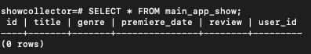

Create a new superuser so we can log into the admin panel: 
```bash
python3 manage.py createsuperuser
```

Give it the same `admin:admin` credentials.

Use admin panel to create user with `testuser1:userpassword1` credentials.

Try to create a new show, and run into error!
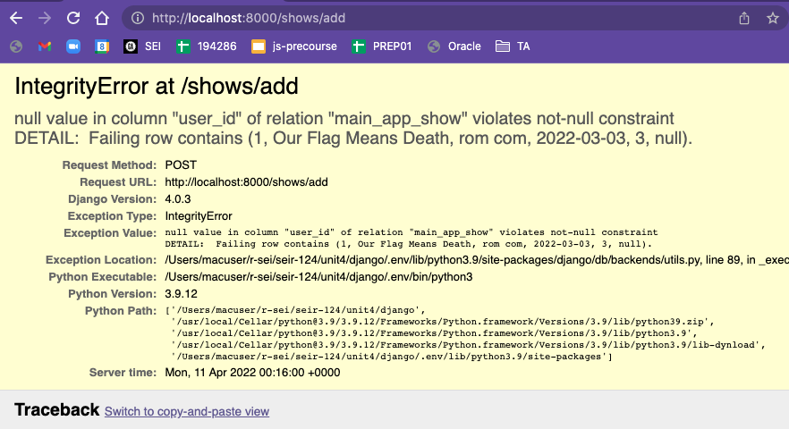

Give the form instance a user property and assign it the value of the request.user.

In `main_app/views.py`:
```python
@login_required(login_url='/login/')
def show_create(request):
    if request.method == 'POST':
        form = ShowForm(request.POST)
        form.instance.user = request.user
        if form.is_valid():
            show = form.save()
            return redirect('profile')
    else:
        form = ShowForm()
    context = {'form': form, 'header': 'Add new tv show', 'user': request.user}
    return render(request, 'show_form.html', context)
```

#

# CHECK IN: can you create a new show via the form, and does it have a user_id in the db?

## Current Code Base

In `main_app/urls.py`:
```python
from django.urls import path
from . import views

urlpatterns = [
    path('', views.home, name='home'),
    path('shows/', views.shows, name='shows'),
    path('shows/add', views.show_create, name='show_create_form'),
    path('shows/<int:pk>/edit', views.show_edit, name='show_edit_form'),
    path('shows/<int:pk>/delete', views.show_delete, name='show_delete'),
    path('login/', views.login_page, name='login_page'),
    path('profile/', views.profile_show, name='profile'),
    path('logout/', views.logout_view, name='logout'),
]
```
In `main_app/views.py`:
```python
from django.shortcuts import render, redirect
from django.http import HttpResponse
from django.contrib.auth import authenticate, login, logout
from django.contrib.auth.decorators import login_required

from .models import Show
from .form import ShowForm

def home(request):
    print('HOME PAGE')
    return HttpResponse('<h1> (╯°□°）╯︵ ┻━┻ </h1>')

def shows(request):
    shows = Show.objects.all()
    return render(request, 'shows_list.html', {'shows': shows})

@login_required(login_url='/login/')
def show_create(request):
    if request.method == 'POST':
        form = ShowForm(request.POST)
        form.instance.user = request.user
        if form.is_valid():
            show = form.save()
            return redirect('profile')
    else:
        form = ShowForm()
    context = {'form': form, 'header': 'Add new tv show', 'user': request.user}
    return render(request, 'show_form.html', context)

@login_required(login_url='/login/')
def show_edit(request, pk):
    show = Show.objects.get(pk=pk)
    if request.method == 'POST':
        form = ShowForm(request.POST, instance=show)
        if form.is_valid():
            show = form.save()
            return redirect('shows')
    else: 
        form = ShowForm(instance=show)
    return render(request, 'show_form.html', {'form': form})

@login_required(login_url='/login/')
def show_delete(request, pk):
    Show.objects.get(pk=pk).delete()
    return redirect('shows')

def login_page(request):
    return render(request, 'login_form.html')

def logout_view(request):
    logout(request)
    return redirect('shows')

def profile_show(request):
    if request.user.is_authenticated:
        shows = Show.objects.filter(title__startswith='O')
        return render(request, 'profile.html', {'shows': shows})
    else:
        username = request.POST['username']
        password = request.POST['password']
        user = authenticate(request, username=username, password=password)
        if user is not None:
            login(request,user)
            return render(request, 'profile.html')
        else:
            print("SOMETHING WENT WRONG WITH LOGIN")
            return redirect('login_page')
```
In `main_app/models.py`:
```python
from django.db import models
from django.contrib.auth.models import User

class Show(models.Model):
    title = models.CharField(max_length=100)
    genre = models.CharField(max_length=50)
    premiere_date = models.DateField(auto_now=False)
    user = models.ForeignKey(User, on_delete=models.CASCADE, related_name='shows', default=None)
    class Rating(models.IntegerChoices):
        LIKE_IT = 1
        LOVE_IT = 2
        GOTTA_HAVE_IT = 3
    review = models.IntegerField(choices=Rating.choices)

    def __str__(self):
        return self.title
```
In `main_app/form.py`:
```python
from django import forms
from .models import Show

class ShowForm(forms.ModelForm):
    class Meta:
        model = Show
        fields = ('title', 'genre', 'premiere_date', 'review')
```

Now we're going to change the view for the profile page, so that we're filtering shows by user's id instead of the hardcoded 'O'.

In `main_app/views.py` change this line in profile_show:
```python
shows = Show.objects.filter(user_id=request.user.id)
```
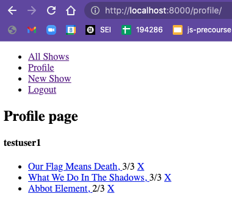

#

# CHECK IN: can you filter shows on the profile by the user who created them?

## Edit/Delete only users resources

In `main_app/views.py`:
```python
def show_delete(request, pk):
    # Show.objects.get(pk=pk).delete()
    show = Show.objects.get(pk=pk)
    if show.user_id == request.user.id:
        show.delete()
    print(show,request.user, 'REQUEST')
    return redirect('shows')
```

#

## User Registration

In `main_app/form.py`:
```python
# add after imports
from django.contrib.auth.forms import UserCreationForm
from django.contrib.auth.models import User
# add after Show form
class SignUpForm(UserCreationForm):
    class Meta:
        model = User
        fields = ('username', 'password1', 'password2')
```
In `main_app/views.py`:
```python
# add to import
from .form import ShowForm, SignUpForm
# add after 'profile_show'
def register(request):
    if request.method == 'POST':
        form = SignUpForm(request.POST)
        if form.is_valid():
            user = form.save()
            if user is not None:
                login(request, user)
                return redirect('profile')
    else:
        form = SignUpForm()
    return render(request, 'register.html', {'form': form})
```
Create 'register.html':
```bash
touch main_app/templates/register.html
```
In `main_app/templates/register.html`:
```html


<section>
    <h1>Signup</h1>
    <form method="POST">
        
        {{ form.as_p }}
        <button type="submit">Save</button>
    </form>
</section>

```
In `main_app/urls.py`:
```python
urlpatterns = [
    # add after 'logout'
    path('signup/', views.register, name='signup_form'),
]
```

Add a link to the signup route.

In `main_app/templates/base.html`:
```html
<li><a href="">Signup</a></li>
<li><a href="">Login</a></li>
```

Try to create a new user, and check it's been entered in the database!
<!-- 
SHOWS ICEBOX
[] only user can edit their made shows
[] user profile edit
[] email user after registration  (Email Docs)[https://docs.djangoproject.com/en/4.0/topics/email/]
[] homepage
[] user registration customization (email)
[] create show_creator model
[] associate show_creator with show 
[] css
-->

#

# Add the Django REST Framework

## Set up Django REST
cd into project in terminal
activate virtual environment 
check git status is clean and server runs

```bash
source .env/bin/activate
```
In the virtual environment, install the djangorestframework package with pip3.
```bash
pip3 install djangorestframework
```
Create a new directory and app with the `startapp`command; whatever argument you provide after will be the name of the app. Then `cd`into it.
```bash
django-admin startapp api
cd api
```

Now we'll save the newly installed package to the list of dependencies in `requirements.txt`: 
```bash
pip3 freeze > requirements.txt
```

That command should create a new .txt file and it's contents should look like the result from "pip3 list". 


```
cd ..

```

Now we'll save the newly installed package to the list of dependencies in `requirements.txt`: 
```bash
pip3 freeze > requirements.txt
```

That command should create a new .txt file and it's contents should look like the result from "pip3 list". 


```bash
touch api/serializers.py
```

In api/serializers.py:
```python
from django.contrib.auth.models import User, Group
from rest_framework import serializers


class UserSerializer(serializers.HyperlinkedModelSerializer):
    class Meta:
        model = User
        fields = ['url', 'username', 'email', 'groups']


class GroupSerializer(serializers.HyperlinkedModelSerializer):
    class Meta:
        model = Group
        fields = ['url', 'name']
```

In api/views.py:
```python
from django.contrib.auth.models import User, Group
from rest_framework import viewsets
from rest_framework import permissions
from api.serializers import UserSerializer, GroupSerializer


class UserViewSet(viewsets.ModelViewSet):
    """
    API endpoint that allows users to be viewed or edited.
    """
    queryset = User.objects.all().order_by('-date_joined')
    serializer_class = UserSerializer
    permission_classes = [permissions.IsAuthenticated]


class GroupViewSet(viewsets.ModelViewSet):
    """
    API endpoint that allows groups to be viewed or edited.
    """
    queryset = Group.objects.all()
    serializer_class = GroupSerializer
    permission_classes = [permissions.IsAuthenticated]
```

In show_collector/urls.py:
```python
from django.contrib import admin
from django.urls import path, include
from rest_framework import routers
from api import views

router = routers.DefaultRouter()
router.register(r'users', views.UserViewSet)
router.register(r'groups', views.GroupViewSet)

urlpatterns = [
    path('admin/', admin.site.urls),
    # refactor urls for main_app
    path('shows/', include('main_app.urls')),
    # include urls for djangorest
    path('', include(router.urls)),
    path('api-auth/', include('rest_framework.urls', namespace='rest_framework'))
]
```

We need to refactor our urls for the shows app. Take out the home route and remove "shows/" from any of the routes. For now we'll leave the user auth urls alone.

In main_app/urls.py:
```python
urlpatterns = [
    path('', views.shows, name='shows'),
    path('add/', views.show_create, name='show_create_form'),
    path('<int:pk>/edit/', views.show_edit, name='show_edit_form'),
    path('<int:pk>/delete', views.show_delete, name='show_delete'),
    path('login/', views.login_page, name='login_page'),
    path('profile/', views.profile_show, name='profile'),
    path('logout/', views.logout_view, name='logout'),
    path('signup/', views.register, name='signup_form'),
]
```

<!-- turns out this part is uncessary and what I was missing was registering the 'rest_framework' under installed apps -->
<!-- 
When there's an error at localhost:8000 try creating a new file.

```bash
mkdir api/templates
mkdir api/templates/rest_framework
touch api/templates/rest_framework/api.html
```


In api/templates/rest_framework/api.html:
```html
<!DOCTYPE html>
<html lang="en">
<head>
    <meta charset="UTF-8">
    <meta http-equiv="X-UA-Compatible" content="IE=edge">
    <meta name="viewport" content="width=device-width, initial-scale=1.0">
    <title>Document</title>
</head>
<body>
    <h1>hello</h1>
    <nav>
        <a href="/shows">shows app</a>
    </nav>
    <main>
        
        
    </main>
</body>
</html>
``` -->

in showcollector/settings.py:
```python
INSTALLED_APPS = [
    'main_app',
    'rest_framework',
    'django.contrib.admin',
    'django.contrib.auth',
    'django.contrib.contenttypes',
    'django.contrib.sessions',
    'django.contrib.messages',
    'django.contrib.staticfiles',
]
```


Add to show_collector/settings.py:
```python
REST_FRAMEWORK = {
    'DEFAULT_PAGINATION_CLASS': 'rest_framework.pagination.PageNumberPagination',
    'PAGE_SIZE': 10
}
```

Now test by running the server and going to localhost:8000 will show us the rest framework client.
Next we'll test with a curl command
```bash
curl -H 'Accept: application/json' -u admin:admin http://127.0.0.1:8000/users/
{
    "count": 2,
    "next": null,
    "previous": null,
    "results": [
        {
            "email": "admin@example.com",
            "groups": [],
            "url": "http://127.0.0.1:8000/users/1/",
            "username": "admin"
        },
    ]
}
```
If that doesn't work then send a request in thunder client where you set the username and password under the auth tab. this should allow you to GET and POST. Make sure you end the urls with a slash or it'll have a bad time. Any user can send their authentication and preform full CRUD on any resource. (no protection of resources)

